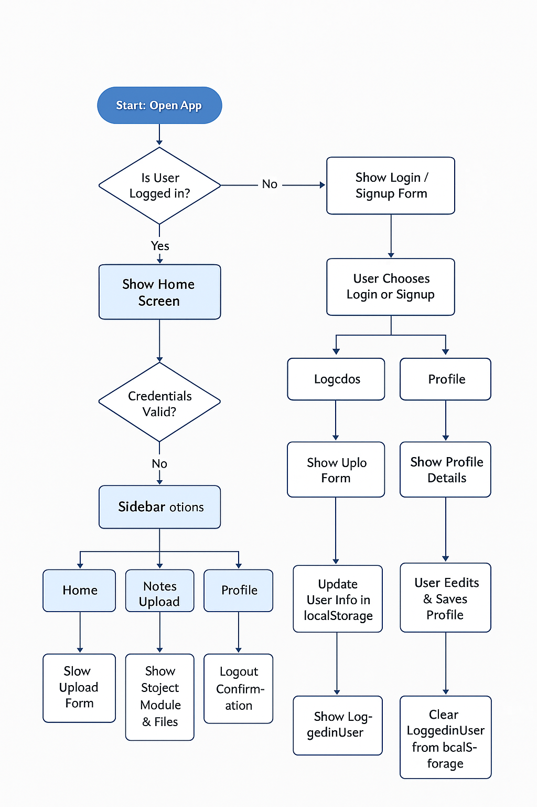

# [NoteItUp] 🎯

## Basic Details
### Team Name: [TWOWISE]

### Team Members
- Team Lead: [Aswathi VA] - [government engineering college idukki]
- Member 2: [Rasmina A] - [government engineering college idukki]
### Project Description
[NoteItUp is a web-based note management app where users can sign up, log in, upload, organize, and view notes categorized by subjects and modules. It also includes user profile management with editable details and profile picture upload.]

### The Problem (that doesn't exist)
[Students and learners often struggle to organize their study notes efficiently and access them easily anytime, anywhere. Many apps are complex or don't let users categorize notes by subject and module properly.]

### The Solution (that nobody asked for)
[NoteItUp offers a simple, clean interface for uploading notes, categorizing them by subject and module, and managing user profiles — all stored locally in the browser for quick access without any backend complexity]

## Technical Details
### Technologies/Components Used
For Software:
- [HTML5, CSS3 (for UI and styling)]
- [JavaScript (for logic and interactivity)]
- [Browser LocalStorage (for storing user data, notes, and session info)]

For Hardware:
- [None (purely web-based app)]

### Implementation
For Software:
# Installation
[No installation required. Just open the index.html file in a modern web browser.]

# Run
[Open the index.html file in Chrome, Firefox, Edge, or Safari to use NoteItUp.]

### Project Documentation
For Software:

# Screenshots (Add at least 3)

*This is the signup page of NoteItUp application*

*This is the login page of NoteItUp application*

*This is the home page of NoteItUp application*

*This is the note uploading  page of NoteItUp application*

*This is the profile uploading page of NoteItUp application*

# Diagrams

*This is the workflow diagram for the NoteItUp application.It is the whole diagramatic representation of the website*

### Project Demo
# Video
[https://drive.google.com/file/d/1UZs6tOqCsUVUWSVR9k-rm6sGfeMchVpu/view?usp=drive_link]
*Login & Signup Forms for user authentication.

Home Page showing uploaded notes organized in folders by subject and module.

Notes Upload Form to select subject/module and upload multiple files.

Profile Page with editable user information and profile picture upload.*

## Team Contributions
- [Aswathi v.a]: [built code with vs code using htmla ,nd javascript documentation]
- [Rasmina a]: [built code with vs code using javascript and css,documentation]

---
Made with ❤️ at TinkerHub Useless Projects 

